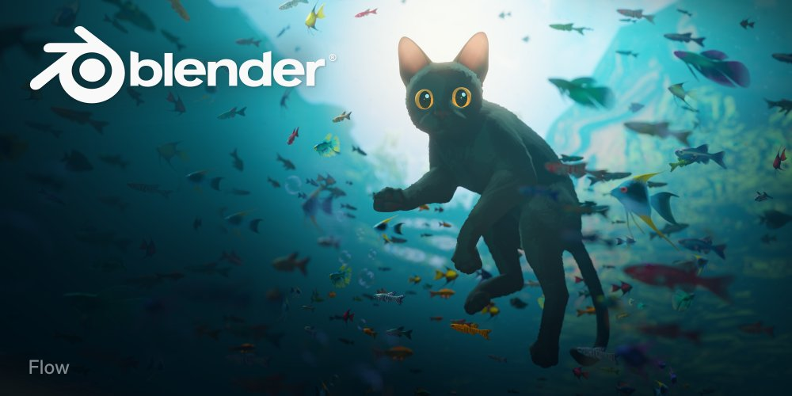

<!-- _class: first -->

# Blender 4.4 β版 公開されたよ!!

<!--
Blender4.4のベータ版が公開されよ!!

今回は、そのなかの動画編集関連の新機能を紹介するよ!!
 -->

---

# VSEの字幕機能が大幅に改善したよ!!

## 旧バージョンの字幕機能は改行処理が残念でした

<!--
旧バージョンでは、字幕を改行するには、改行したい位置に空白を挿入後に、
行の幅を調整する必要がありました。

謎の仕様ですね。
 -->

---

# 字幕機能が大幅に改善したよ!!

## Blender4.4ではカーソルで直接編集可能に!!

<!--
新バージョンでは、タブキーを押すと字幕の編集モードになり、
テキストを普通に編集できるようになりました。
もちろん改行もできます。やったね!!

もう一度Tabキーを押すと通常モードに戻ります。
 -->

---

# 字幕機能が大幅に改善したよ!!

## 「左揃え」、「中央揃え」、「右揃え」 が可能に!!

<!--
文字揃えもできるようになりました。

いままで、センタリングできませんでした。
 -->

---

# 字幕機能が大幅に改善したよ!!

## Box背景の角丸め機能が追加!!

<!--
さらに、Box背景の角丸めも追加されました。
 -->

---

# 字幕機能が大幅に改善したよ!!

## 「アウトライン」や「影付け」は従来通り利用できるよ!!

<!--
従来の縁取りや影つけはそのまま利用できます。
字幕機能が十分まともになりましたね!
 -->

---

<!-- _class: last -->

# 正式リリースは 2025/3/18 (予定)です!!

<!--
正式リリースは2025年3月18日の予定です!!
他にも多くの機能が追加されています。楽しみですね。
 -->
